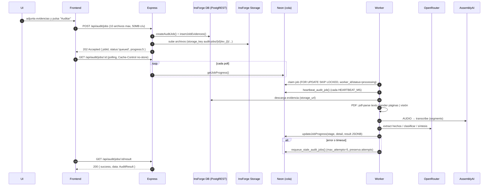

# Arquitectura Actual — Auditor-Cancelaciones

> **Tipo:** Documento de arquitectura actual (línea base verificada).
> **Fecha:** 21/09/2026 | **Fuente:** análisis estático del repositorio.
> **Convención:** ✅ verificado en código · 🔶 inferencia · ⚠️ riesgo.

---

## 1. Mapa de repositorio (árbol real)

```
Auditor-Cancelaciones/
├── src/
│   ├── App.tsx                    # Orquestador UI (754 líneas, monolith)
│   ├── main.tsx
│   ├── index.css
│   ├── types/
│   │   ├── audit.ts               # AuditCase, CaseStatus, EvidenceItem, CallRecord, ManualOverrides
│   │   └── domain.ts              # EducationLevel y términos de dominio
│   ├── components/
│   │   ├── layout/
│   │   │   ├── Sidebar.tsx        # (huérfano: no importado)
│   │   │   └── TopNavbar.tsx      # (huérfano: no importado)
│   │   ├── global/
│   │   │   ├── AuditQueueView.tsx # (huérfano)
│   │   │   ├── ReportsView.tsx    # (huérfano)
│   │   │   ├── PoliciesView.tsx   # (huérfano)
│   │   │   └── SettingsView.tsx   # (huérfano)
│   │   └── audit/
│   │       ├── CaseHeader.tsx, CallTranscript.tsx, CallPlayer.tsx,
│   │       ├── EvidencePanel.tsx, EvidenceFullView.tsx, EvidenceViewer.tsx,
│   │       ├── DictamenPanel.tsx, DictamenFullView.tsx,
│   │       ├── AnalysisFullView.tsx, DecisionTreeModal.tsx,
│   │       ├── MissingDataView.tsx, DetectedFactsPanel.tsx,
│   │       ├── ExternalLinksPanel.tsx, ExternalLinkViewer.tsx,
│   │       ├── AttachEvidenceModal.tsx, EvidenceFirstAddCaseModal.tsx,
│   │       ├── InconsistenciesPanel.tsx, CaseSearchList.tsx, CaseInfoTab.tsx,
│   │       ├── CaseAnalysis.tsx
│   │       └── case-views/
│   │           ├── CaseSummaryView.tsx   # (huérfano)
│   │           ├── CaseDecisionView.tsx  # (huérfano)
│   │           └── CaseDictamenView.tsx  # (huérfano)
│   ├── hooks/
│   │   ├── index.ts               # barrel (exporta 5 hooks)
│   │   ├── useInsforgeBackend.ts  # hook datum con fallback a mocks (268 líneas) ← usado por App
│   │   ├── usePDFGeneration.ts    # ← usado por DictamenFullView
│   │   ├── useMultimodalAudit.ts  # (huérfano)
│   │   ├── useDecisionEvaluation.ts # (huérfano)
│   │   ├── useCaseManager.ts      # (huérfano)
│   │   └── useAudioPlayer.ts      # (huérfano)
│   ├── mock/
│   │   ├── audit-cases.ts         # usado por useInsforgeBackend (fallback)
│   │   ├── tickets.ts             # MVP_TICKETS (usado por useCaseManager, huérfano)
│   │   ├── cases.ts               # MOCK_CASES (usado por tests golden)
│   │   ├── calls.ts               # mockCallCase30274 (transcripción + contacto efectivo)
│   │   └── evidences.ts           # mockEvidencesCase30274 (Flokzu/SIU/I6/Aula)
│   ├── lib/
│   │   ├── api/
│   │   │   ├── config.ts          # ⚠️ HEAVY_API_BASE = https://auditor-api-9e29e329-252e-481c-a632-95b71ee3df51.fly.dev
│   │   │   └── parse-response.ts
│   │   ├── insforge/              # Cliente InsForge
│   │   │   ├── client.ts          # getAnonClient / getAdminClient
│   │   │   ├── types.ts           # row-types (TicketRow, etc.)
│   │   │   ├── repository.ts      # CRUD tickets/evidences/dictamen/events (613 líneas)
│   │   │   ├── adapters.ts        # mapeos frontend↔backend
│   │   │   └── persist-api.ts     # fetch /api/persist/... (cliente HTTP)
│   │   ├── tickets/               # capa legacy de tickets (normalización/workflow) — usada por mocks
│   │   │   ├── types.ts, ticket-factory.ts, template-fields.ts,
│   │   │   ├── ticket-workflow.ts, evidence.ts, analysis.ts, index.ts
│   │   ├── decision-engine/       # Motor determinístico POLICY-LOCKED
│   │   │   ├── decision-engine.ts, rule-engine.ts, types.ts,
│   │   │   ├── conflict-resolver.ts, reasoning-builder.ts, evidence-evaluator.ts,
│   │   │   ├── adapters/case-adapter.ts,
│   │   │   ├── rules/ (15: dates, academic-activity, eligibility, student-request,
│   │   │   │   effective-contact, unreachable, cycle-change, enrollment-error,
│   │   │   │   sales-promise, operational-cancellation, decision35, decision53,
│   │   │   │   documentation, mystery-shopper, retention),
│   │   │   └── __tests__/ (suite + golden-cases)
│   │   ├── extraction/            # Pipeline multimodal (texto/visión/audio)
│   │   │   ├── extraction-service.ts (492 líneas), pdf-extractor.ts,
│   │   │   ├── image-extractor.ts, audio-extractor.ts, structured-extractor.ts,
│   │   │   └── types.ts
│   │   ├── ai/                    # Capa IA (OpenRouter)
│   │   │   ├── client.ts, models.ts (extraction/vision/fallback), prompts.ts,
│   │   │   ├── schemas.ts (Zod), usage.ts (UsageCollector)
│   │   ├── audit/                 # Auditoría multimodal IA
│   │   │   ├── audit-service.ts (463 líneas), prompt.ts, validator.ts,
│   │   │   ├── policy.ts (POLICY_META + índice), types.ts (AuditResultSchema),
│   │   │   ├── pdf-preflight.ts, index.ts
│   │   ├── pdf/                   # Generación de PDF
│   │   │   ├── pdf-generator.ts (managed PDF 26 campos), audit-pdf-generator.ts,
│   │   │   ├── pdf-validator.ts, pdf-preflight, index.ts
│   │   ├── dictamen/              # plantillas de dictamen (UI)
│   │   └── jobs/                  # 📦 Arquitectura asíncrona
│   │       ├── audit-worker.ts        (753 líneas)
│   │       ├── audit-job-repository.ts (359 líneas)
│   ├── server/                    # Capa servidor Express
│   │   ├── app.ts                 # app principal (521 líneas) + endpoints legacy
│   │   ├── persist.ts             # router /api/persist (395 líneas)
│   │   ├── jobs-router.ts         # router /api/audit/jobs (227 líneas)
│   │   ├── progress.ts            # progressStore en memoria (TTL 15 min)
│   │   └── worker.ts              # entrypoint daemon (startWorker/stopWorker, SIGTERM/SIGINT)
│   └── lib/assemblyai.ts          # servicio demo (duplicado de audio-extractor)
├── tests/
│   └── jobs/                      # suite asíncrona offline
│       ├── env.ts (env determinista), fake-repo.ts (217), run-all.ts,
│       ├── pdf-classification.test.ts (208), retry-logic.test.ts,
│       ├── worker-flow.test.ts (245), worker-daemon.test.ts,
│       ├── jobs-api.test.ts (209), mock-e2e.test.ts, worker-shutdown.test.ts
├── api/
│   └── index.ts                   # función serverless Vercel (re-export app)
├── migrations/                    # ⭐ esquema DB canónico
│   ├── 20260918211733_create-auditor-schema.sql   (tickets/evidencias/.../audit_events)
│   ├── 20260918212205_make-auditor-ids-text.sql   (TEXT + quita FKs auth)
│   ├── 20260921000001_create-audit-jobs-schema.sql (audit_jobs + evidencias)
│   └── 20260921000002_fix-stale-requeue-preserve-attempts.sql
├── docs/
│   ├── architecture-current.md, refactor-plan.md, phase6-pdf-generation.md,
│   ├── phase7-integrations.md, information-architecture-v2.md,
│   ├── domain-contracts.md, decision-engine-behavior.md
├── *_(_p*,_c*,_t*,_m*,_probe*,_i*,_h1,_fn_claim,_pr,_pq,_px,_tr1).sql  # ⚠️ scratch de desarrollo (36)
├── server.ts                     # entry daemon (dotenv .env.local, port 3001)
├── api/index.ts                  # función serverless para Vercel
├── Dockerfile                    # tsx server.ts (PORT 3001) worker daemon
├── vercel.json                   # función única /api, maxDuration 60s, rewrites /api/*
├── vite.config.ts                # react + @tailwindcss/vite, port 3000
├── tsconfig.json                 # ⚠️ sin strict
├── package.json                  # scripts lint/test/test:unit/test:golden/test:jobs/serve/worker
├── .env.example                  # ⚠️ incompleto (solo OpenRouter/AssemblyAI/APP_URL)
├── metadata.json                 # proyecto InsForge "Cancelaciones"
├── PROYECTO_DETALLE.md / AGENTS.md
└── (raíz) *.sql scratch
```

---

## 2. Arquitectura por capas (detalle)

### 2.1 Frontend (SPA — Vite/React 19)
- Entry `index.html` → `src/main.tsx` → `src/App.tsx`.
- Estado global administrado por `useInsforgeBackend` (hook datum): carga `mockAuditCases` como fallback, o contra `/api/persist` (InsForge) cuando `usingBackend=true`.
- El monolith `App.tsx` define 7 pestañas de auditoría y renderiza los paneles correspondientes; la evaluación se dispara desde el tipo `summary` vía `analyzeCancellationCase` (motor determinístico) y **persiste** `decision_runs` con firma de datos para no duplicar.

✅ **Persistencia de UI→API:** `persist-api.ts` expone los endpoints `/api/persist/tickets`, `/tickets/:folioOrId`, evidencias (attach/delete), dictamen (save/approve) — usados por `useInsforgeBackend`.

### 2.2 API Server (Express)
`src/server/app.ts`:
- `/health`, `/api/health`
- `/api/audit/evaluate` · `/api/audit/evaluate/batch` (determinístico, síncrono)
- `/api/cases/extract` · `/api/cases/transcribe` · `/api/cases/evaluate-from-draft` (pipeline de extracción)
- `/api/audit/multimodal` (LEGACY/ROLLBACK ONLY, disk-storage, progreso en memoria)
- `/api/audit/multimodal/progress/:id` (LEGACY)
- `/api/persist` (router persist.ts)
- `/api/audit/jobs*` (router jobs-router.ts; POST 202 / GET estado / GET result)
- Error-handler global para multer (413/400).

### 2.3 Worker asíncrono (daemon)
`audit-worker.ts`:
- `claim_next_audit_job` (FOR UPDATE SKIP LOCKED) → `heartbeat_audit_job` → procesamiento por evidencia (PDF/IMAGE/AUDIO) → `synthesizeAuditResult` (OpenRouter) → actualización `progress`/`stage`/`result`.
- `runOneCycle` / `runDaemonCycle` / `startWorker`/`stopWorker`; `AUDIT_CONSTANTS.HEARTBEAT_MS`; `move_requeue` vía `requeue_stale_audit_jobs`.
- `audit-job-repository.ts`: **dos conexiones** — `@neondatabase/serverless` Pool para cola (con `DATABASE_URL`) y cliente InsForge para storage.

### 2.4 Persistencia (InsForge / Neon)
- **InsForge DB** → tablas de negocio (PostgREST, `getAdminClient`).
- **InsForge Storage** → bucket `dictamen-evidencias` (evidencias de jobs y expediente).
- **Neon PG directo** → cola `audit_jobs` (worker).

---

## 3. Flujo de datos principal (jobs asíncronos)



---

## 4. Despliegue y configuración

| Aspecto | Valor verificado | Archivo |
|---|---|---|
| Dev server | `vite --port=3000 --host=0.0.0.0` | `package.json` |
| Daemon API | `tsx server.ts`, PORT 3001 | `server.ts` / `Dockerfile` |
| Worker | `tsx src/server/worker.ts` (`npm run worker`) | `package.json` |
| Serverless | `api/index.ts` + `vercel.json` (un solo `/api`, `maxDuration:60s`, rewrites) | `vercel.json` |
| Base de datos | InsForge: `https://4pw4jdzv.us-west.insforge.app` (proyecto "Cancelaciones") | `metadata.json` / AGENTS.md |
| API pesada | `HEAVY_API_BASE=https://auditor-api-9e29e329-252e-481c-a632-95b71ee3df51.fly.dev` ⚠️ | `src/lib/api/config.ts` |
| Storage | bucket `dictamen-evidencias` | `src/server/jobs-router.ts` |
| Prompt política | GDM_GAM_PRD_MLG_003 v2 (hash sha256 verificada) | `src/lib/audit/policy.ts` |

**Variables de entorno requeridas por el código (verificadas en uso):**

| Variable | Dónde se requiere | Documentada en `.env.example` |
|---|---|---|
| `INSFORGE_URL` | `src/lib/insforge/client.ts` | ❌ |
| `INSFORGE_ANON_KEY` | idem | ❌ |
| `INSFORGE_API_KEY` | idem (admin) | ❌ |
| `DATABASE_URL` | `audit-job-repository.ts` | ❌ |
| `OPENROUTER_API_KEY` | `src/lib/ai/client.ts` | ✅ |
| `ASSEMBLYAI_API_KEY` | `audio-extractor.ts` | ✅ |
| `APP_URL` | (algún uso) | ✅ |
| `AI_EXTRACTION_MODEL` / `AI_VISION_MODEL` / `AI_FALLBACK_MODEL` / `AI_EXTRACTION_CONCURRENCY` | `src/lib/ai/models.ts` | ❌ |
| `AUDIT_JOB_MAX_ATTEMPTS`, `AUDIT_WORKER_HEARTBEAT_MS`, `AUDIT_WORKER_POLL_MS`, `AUDIT_EVIDENCE_CONCURRENCY` | worker/repo/tests | ❌ |

> ⚠️ **Hallazgo:** `.env.example` está incompleto vs. el código. Onboarding nuevo requiere adivinar variables.

---

## 5. Riesgos de arquitectura (resumen)

| # | Riesgo | Severidad | Detalle |
|---|---|---|---|
| 1 | Despliegue bifurcado | P1 | La misma app Express corre como daemon (3001, sin límite) y como función Vercel (60 s). Los endpoints síncronos pesados (`multimodal`) son inviables en Vercel. |
| 2 | URL externa hardcodeada | P0 | `HEAVY_API_BASE` → Fly.io, uso directo desde el navegador; sin env por entorno. |
| 3 | Cola sin acoplar a dominio de negocio | 🔶 Medio | `audit_jobs` no referencia `ticket_id`/`folio`; el resultado es JSONB. La trazabilidad expediente→job es indirecta (frontend la guarda). |
| 4 | Estado en memoria | P1 | `progressStore` no sobrevive restarts (legacy). |
| 5 | secrets en cliente | P1 | El frontend usa anon key; el servidor usa service key. Si la service key se filtra, RLS se anula. |
| 6 | Scratch SQL en raíz | P2 | 36 SQL de desarrollo sin borrar (ruido en repo). |

---

## 6. Decisiones de arquitectura heredadas (consecuencias)

1. **"Policy locked" en código:** reglas TS con header de advertencia — requiere PR humano para cambiar política → procesos lentos de cambio normativo; **sin versionado explícito**.
2. **Estrategia de "legacy + nuevo":** se mantuvo el pipeline síncrono como fallback; doble mantenimiento.
3. **`pdf-parse` + `pdf-lib` local** para no depender de servicios de render en cada execución de jobs.
4. **Worker daemon separado** del servidor API por límites de plataforma (Vercel 60 s) — decisión correcta pero el daemon debe escalar/operar aparte.
5. **El nuevo modelo "Mejora Continua" exigirá:** entidades para política/reglas/numerales/versión/ventanas/KPIs/planes; esto impacta 2.1, 2.2, 2.3 y el modelo de datos (ver `GAP_NUEVO_MODELO.md`).