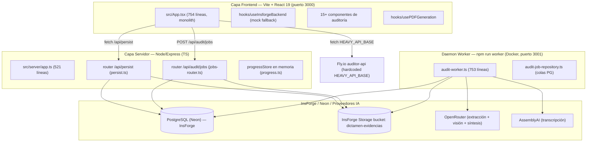
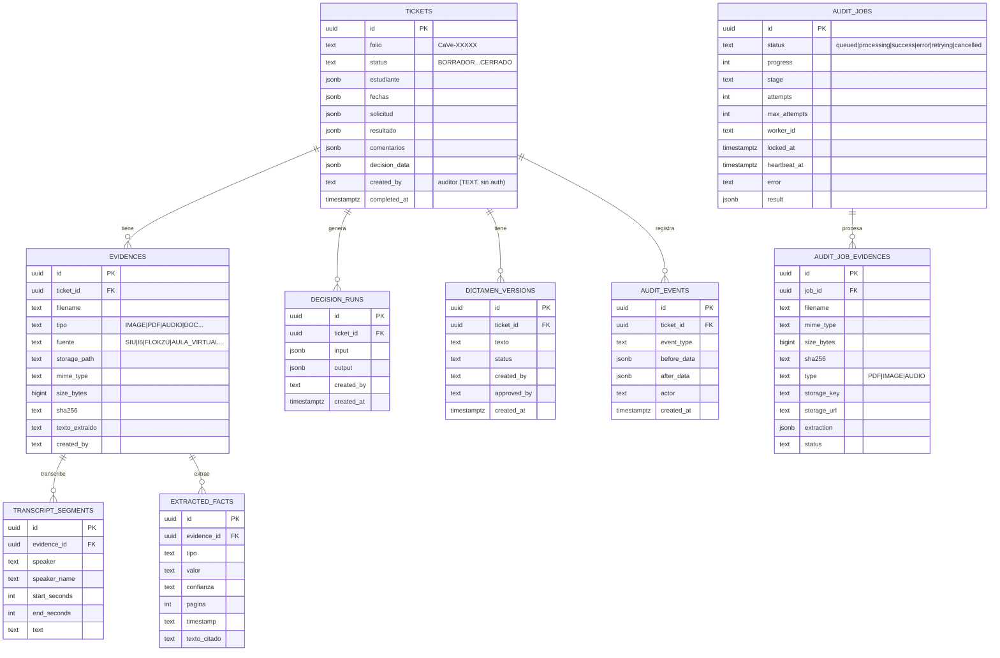
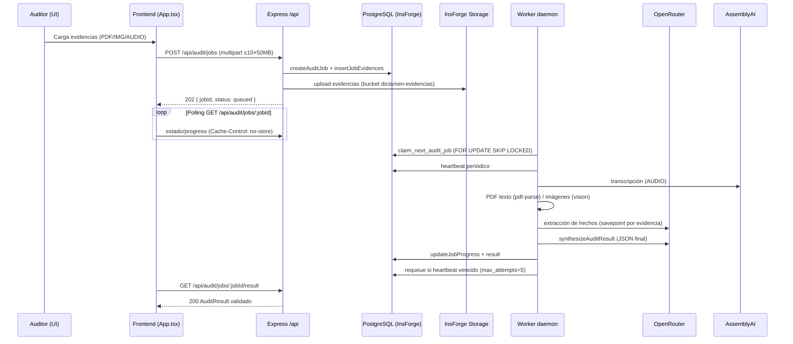

# Auditoría del Proyecto — Auditor-Cancelaciones

> **Tipo de documento:** Auditoría técnica/funcional/producto (solo lectura).
> **Fecha de la auditoría:** 21/09/2026
> **Alcance:** Repositorio completo `Auditor-Cancelaciones` (frontend, API, worker asíncrono, persistencia InsForge/PostgreSQL, motor de decisiones, pipeline de auditoría multimodal, generación de PDF, tests, docs y scripts).
> **Convención:** ✅ = hecho verificado en el código; 🔶 = inferencia razonada (no contrastada con ejecución); ⚠️ = hallazgo de riesgo.
> **Limitación del entorno:** `npm`/`node`/`npx` no están disponibles en esta máquina (ni PATH ni rutas comunes). No se ejecutaron `tsc --noEmit` ni las suites de tests. Todo lo que sigue es **análisis estático de código**.

---

## 1. Resumen ejecutivo

La aplicación es un **sistema de auditoría de expedientes de cancelación de ventas / deserción de estudiantes** (proceso de negocio UTEL). Está construida sobre **InsForge (BaaS: PostgreSQL + Storage + gateway OpenRouter)** con un renderizado **SPA en Vite/React 19** y una **API Node/Express** desplegada con **dos runtimes distintos**: una función serverless en Vercel (`/api`) y un **daemon Docker** (`server.ts`, puerto 3001) que aloja tanto la API headless como el worker asíncrono.

Puntos centrales verificados:

1. ✅ **Dos motores de dictamen coexisten** y son conceptualmente distintos:
   - **Motor determinístico de reglas** (`src/lib/decision-engine/`): 15 reglas, "POLICY-LOCKED", sin IA.
   - **Auditoría multimodal con IA** (`src/lib/audit/` + `audit-service.ts`): el modelo lee evidencias + el **texto íntegro de la política** (hash SHA-256 verificado) y emite un dictamen estructurado validado con Zod.
2. ✅ **Arquitectura asíncrona de jobs** para la auditoría multimodal (`audit_jobs` + worker), con claim/heartbeat/requeue en PostgreSQL, además de endpoints legacy síncronos marcados `LEGACY / ROLLBACK ONLY`.
3. ⚠️ **Identidad de auditor sin autenticación real**: `created_by`/`actor`/`approved_by` pasaron a `TEXT`; se eliminaron FKs a `auth.users` (migración `20260918212205`). El acceso al backend se soporta en claves de API de servicio en el servidor.
4. ⚠️ **Discrepancia de despliegue IA**: el frontend apunta a una URL Fly.io **hardcodeada** (`HEAVY_API_BASE`) mientras los docs describen InsForge Compute.
5. ⚠️ **Configuración incompleta documentada**: `.env.example` no lista `INSFORGE_URL`, `INSFORGE_ANON_KEY`, `INSFORGE_API_KEY` ni `DATABASE_URL`, que el código requiere.
6. ✅ **Pruebas automatizadas presentes** (motor de decisiones con casos golden y suite de jobs asíncrona con fakes, offline-capable), pero **no ejecutadas** en este entorno.

**Veredicto de madurez:** el proyecto está en fase **Beta funcional / transición a producción**. El flujo nuevo (jobs asíncronos) está bien diseñado; el flujo legacy se mantiene para rollback. La deuda principal no es funcional sino **de gobierno (configuración, secreto de despliegue, consistencia de docs, seguridad de datos) y de modelo de datos para el nuevo enfoque "Mejora Continua"**.

---

## 2. Contexto del producto

- **Propósito:** auditar expedientes de cancelación de venta/baja de estudiantes conforme al procedimiento `GDM_GAM_PRD_MLG_003` v2 (19/02/2025, 19 páginas, hash SHA-256 verificado en `src/lib/audit/policy.ts`).
- **Usuarios objetivo:** auditor de calidad / analista de cancelaciones (un solo rol nominal "Auditor Principal" en el frontend; sin diferenciación de roles).
- **Entradas:** evidencias de Flokzu (ticket CAVE), SIU (historial académico/financiero), I6 (intentos de contacto/CRM), Aula Virtual (actividad), grabaciones de llamadas y capturas de pantalla (ver mocks en `src/mock/` y `docs/phase7-integrations.md`).
- **Salidas:** dictamen fundamentado con citas normativas y evidenciales + **PDF canónico** (spec CaVe-28259, 22 campos; `docs/phase6-pdf-generation.md`, `src/lib/pdf/pdf-generator.ts`).
- **Métricas de negocio existentes:** plazos nominales como respuesta de Flokzu en 72h (mock `src/mock/evidences.ts`), mínimo de 15 llamadas y 6 interacciones escritas para caso ilocalizable (migración de regla `RULE_NODO7_UNREACHABLE` en `evidence-evaluator.ts`).

---

## 3. Arquitectura actual (real)

Tres capas con **dos runtimes de servidor**:

**Runtimes de server (verificado):**

| Runtime | Entry | Puerto | Rol |
|---|---|---|---|
| Daemon Docker | `server.ts` → `src/server/app.js` | 3001 | API headless + worker (`npm run worker`) |
| Serverless Vercel | `api/index.ts` (3 líneas) + `vercel.json` | — | Una sola función `/api`, `maxDuration: 60s`, rewrite de todo `/api/*` |

⚠️ **Observación de despliegue:** la app Express se despliega en dos runtimes con restricciones distintas (60 s en Vercel vs. daemon sin límite). Los endpoints síncronos legacy (`/api/audit/multimodal`, `/api/audit/evaluate`) pueden superar 60 s con evidencias pesadas; el archivo `vercel.json`+`api/index.ts` solo es apto para las rutas rápidas (persist + jobs ligeros). El worker real vive en el contenedor Docker.

---

## 4. Modelo de datos (PostgreSQL / InsForge)

Esquema canónico en `migrations/*.sql` (4 migraciones). Entidades principales:

**Notas verificadas:**
- ✅ `migrations/20260918212205_make-auditor-ids-text.sql`: auditoría sin auth — columnas de identidad a `TEXT`, se eliminan FKs a `auth.users`, y se recrean policies de `tickets` comparando `created_by::text = auth.uid()::text`.
- ✅ `migrations/20260921000001_create-audit-jobs-schema.sql`: `audit_jobs` + `audit_job_evidences` con índices en status/created/updated/worker; contiene la lógica de claim/heartbeat/requeue v1.
- ✅ `migrations/20260921000002_fix-stale-requeue-preserve-attempts.sql`: fix de `requeue_stale_audit_jobs` V2 (preserva `attempts`, considera `heartbeat_at` NULL **o** vencido, o `locked_at` vencido sin `started_at`; respeta `heartbeat_timeout_ms`).
- ✅ `src/lib/insforge/types.ts` (178 líneas) define los row-types del cliente (`TicketRow`, etc.).
- 🔶 La tabla `extracted_facts` está mapeada pero la extracción del worker la persiste dentro de `audit_job_evidences.extraction` (JSONB); la relación entre el schema "ticket/evidencia" y los jobs es indirecta (el job no referencia `ticket_id` en el DDL verificado).

---

## 5. Flujo de auditoría real (end-to-end)

**Ruta alternativa (legacy, solo rollback):** `POST /api/audit/multimodal` (síncrono, disk-storage, progreso en memoria) — marcado `LEGACY / ROLLBACK ONLY` en `app.ts` y documentado como propenso a 502 en scale-to-zero.

**Ruta determinística (sin IA):** `POST /api/audit/evaluate` y `/evaluate/batch` (hasta 100 casos) usan `analyzeCancellationCase` del motor de reglas.

---

## 6. Motor de decisiones: árbol → reglas (POLICY-LOCKED)

- ✅ **Entrada nominal:** `CaseDecisionData` (legacy, `src/lib/decision-engine/types.ts`, ~60 campos) o `CancellationCase` (nueva estructura normalizada).
- ✅ **Pipeline:** `analyzeCancellationCase` → `RuleEngine` sobre un `RuleRegistry` por defecto → `resolveDecisionConflict` (NODO 18) → `requiredEvidenceForRule` (NODO 21) → `buildReasoningAndConfidence`.
- ✅ **15 reglas** (`src/lib/decision-engine/rules/`): `dates`, `academic-activity`, `eligibility`, `student-request`, `effective-contact`, `unreachable`, `cycle-change`, `enrollment-error`, `sales-promise`, `operational-cancellation`, `decision35`, `decision53`, `documentation`, `mystery-shopper`, `retention`.
- ✅ **Header de bloqueo de política** en `decision-engine.ts`: *"AI extraction services MUST NOT modify, override or bypass these rules."*
- ✅ **Conflicto:** prioridad numérica ascendente (1 = mayor); caso especial `STUDENT_REQUEST/RETENTION` vs `OPERATIONAL/MATERIAL_LOAD`.
- ✅ **Salida `DecisionResult`:** clasificación, confianza, causa raíz, hard blockers, reglas aplicadas/descartadas, evidencia faltante, inconsistencias, razonamiento, referencias, conflictos (con alias en español).
- ✅ **Tests:** `src/lib/decision-engine/__tests__/` (suite + casos golden, `golden-cases.ts` usa `MOCK_CASES`).

**Interpretación para "Mejora Continua":** el árbol de decisión fue reemplazado por un motor de reglas con registro desacoplado (`RuleRegistry` permite registrar/desregistrar reglas en runtime). Es el punto de extensión natural para reglas configurables. ⚠️ Sin embargo, las **condiciones de cada regla están en código TS**, no parametrizadas desde la DB/política; un modelo de mejora continua requeriría **definir reglas como datos** o al menos versionarlas explícitamente.

---

## 7. Auditoría multimodal IA (nuevo pipeline)

- ✅ `src/lib/audit/audit-service.ts` (463 líneas): `MAX_PAGES_PER_PDF=50`, umbral de página gigante 4000, hasta `MAX_RETRIES=1`, `MAX_RESPONSE_TOKENS=8000`, concurrencia de preparación 2.
- ✅ Preparación por tipo: PDF con texto utilizable → texto por página; PDF escaneado/FireShot → render a imágenes; IMAGE → data URL; AUDIO → transcripción AssemblyAI (errores marcan `processingStatus: ERROR`).
- ✅ El modelo recibe **evidencias + texto íntegro de la política** (prompt versionado `AUDIT_PROMPT_VERSION = '1.0.0'`) y debe emitir JSON según `AuditResultSchema` (Zod): `politica`, `ejecucion`, `expediente`, `cobertura`, `cronologia`, `hallazgos`, `reglasEvaluadas` (numeral→status CUMPLE/NO_CUMPLE/NO_ACREDITADO/NO_APLICA/INCONGRUENCIA), `incidencias` (7 tipos, impacto BLOQUEANTE/RELEVANTE/INFORMATIVO) y `resultado`.
- ✅ `validator.ts`: valida esquema Zod, cobertura, citas normativas contra `POLICY_INDEX` (`validateNormativeRef`) y política (código/versión).
- ✅ `policy.ts`: `POLICY_META` con código `GDM_GAM_PRD_MLG_003`, versión 2, fecha 19/02/2025, sha256 fijo, e índice de 22 numerales. `getPolicyTextForModel` provee el texto al prompt.
- ⚠️ **Modelo por defecto de visión para síntesis:** `qwen/qwen3-vl-8b-instruct` (`src/lib/ai/models.ts`); extracción `openai/gpt-5-nano`; fallback `google/gemini-2.5-flash-lite`. Configurables vía env.

---

## 8. Política vs. reglas vs. hechos

| Concepto | Representación actual | Archivos clave |
|---|---|---|
| **Política (normativa)** | Texto íntegro + hash + índice de numerales; única fuente normativa para la IA | `src/lib/audit/policy.ts`, `prompt.ts` |
| **Reglas (interpretación)** | Código TS "POLICY-LOCKED" + registro/configuración por defecto + resolución de conflictos | `src/lib/decision-engine/` *(15 reglas)* |
| **Hechos (evidencia)** | `ExtractedFact` / `ExtractedField` con confianza, página, timestamp, cita textual; hechos visuales Fase 1 (`VisualFacts`) | `src/lib/extraction/types.ts`, `src/lib/ai/schemas.ts` |

🔶 **Brecha estructural para "Mejora Continua":** hoy la política solo se relaciona con las reglas en dos puntos: (a) comentarios/IDs textuales en el motor TS, y (b) el texto inyectado al prompt de IA. No hay una representación **relacional** (tabla de numerales, tabla de reglas, tabla de condiciones, versión efectiva, ventanas temporales configurables). Esto es el corazón del GAP del nuevo modelo.

---

## 9. Ventanas temporales y contacto efectivo

- ✅ **Ventanas temporales el día de hoy:** `getDaysFromStart`, `isWithinDesertionPeriod`, `isWithinCancellationWindow`, `isPriorToStart` en `src/lib/decision-engine/rules/dates.ts`. `diasHabilesDesdeInicio` se **satura a ≤10** y `semanasDesdeInicio` se deriva por 7 días **sin calendario de días hábiles institucional** en `draftToDecisionData` (`src/server/app.ts`).
- ✅ **Contacto efectivo:** regla `effective-contact.ts` + estructuras `CaseContacts` / `CaseCycleChange` / `CaseRetention`; criterios verificables en `src/mock/calls.ts` (contacto titular, identificación institucional, objetivo, datos/pago, manifestación, vínculo a política).
- ✅ **Ilocalizable:** 15 llamadas en horario válido + 6 interacciones escritas (regla `unreachable.ts`; requisito de evidencia `REPORTE_I6_15_LLAMADAS` y `HISTORIAL_6_INTERACCIONES_ESCRITAS` en `evidence-evaluator.ts`).

🔶 Para mejora continua se requeriría: **calendario institucional de días hábiles parametrizable**, ventanas por numeral configurables, y SLA por etapa.

---

## 10. SLAs e indicadores (IA por función de proceso)

- ✅ SLAs nominales identificados: respuesta Flokzu ≤72 h (mock `src/mock/evidences.ts`), intentos mínimos de contacto (15 llamadas/6 escritas), plazo de dictamen (workflow de tickets en `src/lib/tickets/`).
- 🔶 **No existe un módulo de métricas** (dashboard, KPI por función, tendencias). El nuevo modelo "Mejora Continua" pide **indicadores por función del proceso** (atención, contacto, plataforma, financiero, dictamen) con trazabilidad a numerales. No hay hoy una tabla de KPIs ni agregaciones.
- ✅ `UsageCollector` (`src/lib/ai/usage.ts`) registra en consola (`llm_usage`) llamadas/tokens/fallbacks por ejecución; no persiste.

---

## 11. Trazabilidad

- ✅ Dictamen IA: `evidenceRefs` (con página/timestamp) y `citasNormativas` por regla evaluada; `hallazgos` y `incidencias` con referencias.
- ✅ Motor de reglas: `evidenceReferences`, `missingEvidence`, `conflicts` (reglas A/B + resolución).
- ✅ Persistencia de auditoría: `audit_events` (before/after), `decision_runs` (input/output JSONB), `dictamen_versions` (histórico + aprobador).
- ⚠️ **No hay trazabilidad de versión de reglas en DB**: `decision_runs.output` guarda el snapshot, pero no se persiste cuál versión de la política/reglas produjo el resultado (el hash de política existe en la IA pero no en el motor TS).

---

## 12. Usuarios, roles y seguridad

- ✅ Sin autenticación en frontend; identidad = `TEXT` ("Auditor Principal" hardcodeado en `useInsforgeBackend.ts`; `createdBy: 'Auditor Principal'` en `saveDictamen`).
- ✅ `src/lib/insforge/client.ts`: cliente **anon** (frontend, con anon key) y cliente **admin** (servidor, con API key de servicio).
- ⚠️ **Riesgos de seguridad:**
  - Acceso a datos gobernado por claves de API embebidas + RLS condicionado (policies de tickets reconstruidas en la migración de TEXT). Con `getAdminClient` cualquier proceso servidor con la service key **salta RLS** (no verificado su uso indiscriminado).
  - Sin rate limiting, sin sanitización de folios (inyección mitigada por PostgREST), subidas de hasta 50 MB × 10 archivos sin análisis antivirus.
  - `OPENROUTER_API_KEY` y `ASSEMBLYAI_API_KEY` solo en servidor ✅.
  - `HEAVY_API_BASE` en código cliente expone el endpoint Fly.io (sin auth aparente) — el frontend habla directo con un servicio externo.

---

## 13. UI/UX

- ✅ `src/App.tsx`: monolith de 754 líneas que orquesta: sidebar de casos, encabezado con 7 tabs (`summary`, `call`, `evidences`, `analysis`, `dictamen`, `missing-data`, `facts`), `CallPlayer`, `EvidencePanel`, `AnalysisFullView`, `DictamenPanel`, `DictamenFullView`, `EvidenceFullView`, `MissingDataView`, `DetectedFactsPanel`, `ExternalLinksPanel`/`Viewer`, modales (`DecisionTreeModal`, `AttachEvidenceModal`, `EvidenceFirstAddCaseModal`).
- ✅ `useInsforgeBackend` (268 líneas) con **fallback a mocks** (`src/mock/audit-cases.ts`) cuando no hay backend.
- ✅ `usePDFGeneration` → `DictamenFullView` (genera PDF canónico con sha256).
- ⚠️ **Componentes huérfanos (no importados por App):** `AuditQueueView`, `SettingsView`, `ReportsView`, `PoliciesView` (`src/components/global/`), `Sidebar`, `TopNavbar` (`layout/`), `CaseSearchList`, `CaseInfoTab`, `InconsistenciesPanel`, `CaseSummaryView`, `CaseDecisionView`, `CaseDictamenView`, `CaseAnalysis`. Hooks huérfanos: `useCaseManager`, `useDecisionEvaluation`, `useAudioPlayer`, `useMultimodalAudit` (exportados en `src/hooks/index.ts`). Esto indica una migración de UI a medias entre dos noches de vistas.
- 🔶 Tailwind CSS `4.1.14` con `@tailwindcss/vite` (verificado en `package.json`/`vite.config.ts`) vs. **AGENTS.md que exige Tailwind 3.4** → decisión pendiente.

---

## 14. Calidad

- ✅ `package.json`: `lint` = `tsc --noEmit`; `test`/`test:golden` = motor de decisiones; `test:jobs` = suite jobs (fakes + env determinista en `tests/jobs/env.ts`); `test:unit` = run-cli.
- ✅ Suites identificadas: `tests/jobs/` (pdf-classification, retry-logic, worker-flow, worker-daemon, jobs-api, mock-e2e, worker-shutdown) + `src/lib/decision-engine/__tests__/` (suite + golden cases).
- ⚠️ `tsconfig.json` **sin `"strict": true`** (verificado en checkpoint de configuración) — tipos menos seguros.
- ⚠️ No se observó capa de tests para la UI (sin vitest/RTL/suplementos de testing en `package.json`).
- ⏸️ En este entorno no se pudo ejecutar la verificación (`node`/`npm` ausentes). **Pendiente de ejecutar** (offline-capable para jobs).

---

## 15. Integraciones

| Integración | Estado | Punto |
|---|---|---|
| InsForge Database (PostgREST) | ✅ Uso activo | `src/lib/insforge/`, `/api/persist` |
| InsForge Storage | ✅ Uso activo (bucket `dictamen-evidencias`) | `jobs-router.ts` / `persist.ts` |
| Neon PostgreSQL (cola jobs) | ✅ Uso activo | `audit-job-repository.ts` |
| OpenRouter (LLM/visión) | ✅ Uso activo (servidor) | `src/lib/ai/client.ts` |
| AssemblyAI (transcripción) | ✅ Uso activo (servidor) | `src/lib/extraction/audio-extractor.ts`, `src/lib/assemblyai.ts` |
| Fly.io API pesada | ✅ Uso activo (frontend) | `src/lib/api/config.ts` `HEAVY_API_BASE` |
| Vercel | ✅ Deploy serverless | `vercel.json`, `api/index.ts` |
| Docker | ✅ Deploy daemon | `Dockerfile` (`tsx server.ts`, PORT 3001) |
| `pdf-parse` / `pdf-lib` | ✅ Generación/extracción PDF local | `src/lib/pdf/`, `src/lib/extraction/pdf-extractor.ts` |
| Conectores futuros (SIU, I6, Flokzu, Aula Virtual) | 🔶 Roadmap | `docs/phase7-integrations.md` |

---

## 16. Clasificación del código reusable

| Capa | Reusabilidad | Detalle |
|---|---|---|
| `src/lib/decision-engine/` (core: engine, registry, conflict, reasoning, evidence-evaluator) | 🟢 **Alta** | Motor genérico de reglas con registro desacoplado; reutilizable con otro set de políticas |
| `src/lib/decision-engine/rules/` | 🟠 **Media (específica)** | Las 15 reglas son de negocio; el patrón es reusable |
| `src/lib/audit/` (service, prompt, validator, policy) | 🟢 **Alta** | Pipeline de auditoría IA parametrizable por política+esquema |
| `src/lib/extraction/` | 🟢 **Alta** | Pipeline multimodal genérico (texto/visión/audio + hechos con confianza) |
| `src/lib/ai/` | 🟢 **Alta** | Cliente OpenRouter encapsulado, modelos configurables, middleware de usuario |
| `src/lib/jobs/` (worker + repo) | 🟢 **Alta** | Cola de trabajos genérica (claim/heartbeat/requeue/síntesis) sin acoplar a dominios |
| `src/lib/insforge/` | 🟢 **Alta** | Cliente CRUD + adapters genéricos sobre InsForge |
| `src/lib/pdf/` + `src/lib/dictamen/` | 🟠 **Media** | Motor de PDF con plantilla de campos; los campos son específicos de negocio |
| `src/App.tsx` + `src/components/audit/*` | 🔴 **Baja (app-specific)** | UI monolith fuertemente acoplada al flujo de cancelaciones |

🔶 **Estimación de % de reuso:** ≈ **60–65 % del código** es reusable/migrable a otro dominio (capa lib) vs. ~35–40 % específico de UI/casos. (Inferencia basada en LOC por capa verificados arriba.)

---

## 17. Deuda técnica (clasificación P0–P3)

### P0 — Crítico (bloquea producción/gobierno)
1. ⚠️ **`HEAVY_API_BASE` hardcodeado a Fly.io** en `src/lib/api/config.ts`; el frontend depende de un servicio externo sin auth aparente y fuera del ecosistema InsForge. Riesgo: indisponibilidad/deriva entre entornos.
2. ⚠️ **Configuración documentada incompleta**: `.env.example` omite `INSFORGE_URL`, `INSFORGE_ANON_KEY`, `INSFORGE_API_KEY`, `DATABASE_URL` — onboarding y reproducibilidad frágiles.
3. ⚠️ **Modelo de identidad sin auth + service key en servidor**: permite acceso administrativo a cualquier proceso con la clave; sin roles, sin auditoría de quién aprueba (solo TEXT).

### P1 — Alto
4. ⚠️ `progressStore` en memoria (perdida en restart) — aceptable solo para el legacy.
5. ⚠️ `vercel.json` `maxDuration: 60s` con endpoints síncronos potencialmente más lentos (502 en scale-to-zero, ya documentado en código).
6. ⚠️ **Dos motores de dictamen mantenidos** (TS-POLICY-LOCKED y texto-política-IA) → divergencia de criterio posible si cambia la política (la IA se re-entrena por texto; el motor TS requiere PR manual).
7. ⚠️ `tsconfig.json` sin `strict`; Tailwind 4 instalado vs. 3.4 requerido por AGENTS.md.

### P2 — Medio
8. Componentes/hooks huérfanos (~13 componentes + 4 hooks no importados).
9. Docs desactualizados: `docs/architecture-current.md`, AGENTS.md vs. realidad (deploys, Tailwind, modelos).
10. Duplicación de servicios de audio (`src/lib/assemblyai.ts` vs `audio-extractor.ts`).
11. Segmentación de páginas gigantes simplificada (código indica que "real splitting" requeriría sharp/canvas; hoy envía la página completa).
12. ~36 archivos SQL scratch en la raíz (`_p*.sql`, `_c*.sql`, `_m*.sql`, `_t*.sql`, `_probe_*.sql`, `_smoke_import_probe.sql`, `_fn_claim.sql`, `_h1.sql`, `_pr.sql`, `_pq.sql`, `_px.sql`, `_tr1.sql`) — ojalá fuera de la raíz y borrados tras migración.

### P3 — Baja
13. `package.json` name `"react-example"`.
14. Duplicación de datos mock entre `tickets.ts`/`cases.ts`/`audit-cases.ts`.
15. Sin tests UI; sin CI visible.

---

## 18. Información faltante y verificación pendiente

| Ítem | Tipo |
|---|---|
| Ejecución de `tsc --noEmit`, suites `test:unit`/`test:golden`/`test:jobs` (no posible aquí por falta de Node) | ⏸️ PENDIENTE |
| DDL real aplicado en producción (¿existen policies activas? ¿RLS habilitado?) | BLOQUEANTE |
| Política de "Mejora Continua": alcance, KPIs, fuentes de datos, frecuencia, dueño | BLOQUEANTE |
| Secretos/URLs reales de entorno (no se exponen) | — |
| Estado real del bucket de storage y permisos | IMPORTANTE |
| Qué endpoints consume hoy el frontend de Fly.io vs. `api.index.ts` en Vercel | IMPORTANTE |

---

## 19. Conclusión

El sistema es **sólido en su núcleo de ingeniería** (motor de reglas desacoplado, pipeline de auditoría con hash de política, cola asíncrona recuperable, tests de jobs con fakes) y está **verde en gobernanza y transición**: despliegue bifurcado, URL externa hardcodeada, identidad sin auth real, docs desalineados y **sin representación de datos para el modelo "Mejora Continua"** (numerales/reglas/KPIs/versiones no son entidades). El siguiente paso lógico es el documento de **GAP vs. nuevo modelo** (`GAP_NUEVO_MODELO.md`) y el **contexto para el plan de implementación** (`CONTEXTO_PARA_PLAN_IMPLEMENTACION.md`).