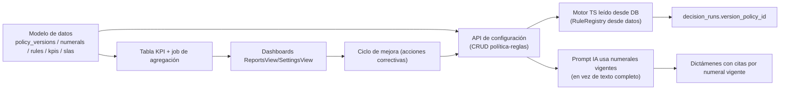

# GAP — Preparación del sistema para el nuevo modelo "Mejora Continua"

> **Objetivo:** identificar la brecha entre el sistema actual (auditoría de expedientes bajo GDM_GAM_PRD_MLG_003 v2) y el modelo de auditoría de **"Mejora Continua"**.
> **Fecha:** 21/09/2026 · **Método:** análisis estático del repositorio.
> **Convención:** ✅ verificado · 🔶 inferencia sobre requisitos del nuevo modelo (a confirmar con el negocio) · ⚠️ riesgo.

---

## 1. Contexto: qué significa "Mejora Continua" para este sistema

🔶 El término "Mejora Continua" (modelo de auditoría) se interpreta aquí como la evolución del enfoque actual —dictamen caso-a-caso conforme una política fija— hacia un modelo en el que:

1. **La política se modela como dato** (versiones, vigencia, numerales, reglas, condiciones), no solo como texto/código.
2. Las **reglas de negocio son configurables** y versionables; los cambios normativos no exigen PR de código.
3. Se definen **indicadores por función del proceso** (atención, contacto, plataformas, financiero, dictamen) con **ventanas temporales y SLAs configurables**.
4. Se mantiene **trazabilidad completa**: dictamen → regla → numeral → versión de política → evidencia → auditor.
5. Se observa **ciclo de mejora**: detección de desviaciones → acciones correctivas → actualización de reglas/política → re-medición.
6. Existen **roles y autenticación** para auditar quién y cuándo modificó política/reglas.

⚠️ **Supuestos del negocio aún por confirmar** (ver Sección 9 — BLOQUEANTES). Si la definición oficial difiere, ajustar la matriz siguiente.

---

## 2. Matriz GAP general (capacidad actual → requerida)

| # | Capacidad | Estado actual | Requerido por Mejora Continua | Brecha | Impacto |
|---|---|---|---|---|---|
| G1 | Representación de la política | Texto + hash + índice de numerales (`policy.ts`); usada solo por el prompt IA | Política como datos (tabla de numerales, versión, vigencia) con API | 🔴 Alta | Reglas en código + texto IA divergen; sin versionado semántico |
| G2 | Reglas de negocio | 15 reglas TS "POLICY-LOCKED" + RuleRegistry en memoria | Reglas configurables/persistidas y versionadas; validación en runtime | 🔴 Alta | Cambio normativo = PR manual; no hay SLO de vigencia |
| G3 | Hechos (evidencia) | `ExtractedFact`/`ExtractedField` con confianza; hechos visuales Fase 1 | Mismo modelo, pero con vínculo explícito a numeral/regla que acredita | 🟠 Media | Falta schema de "qué numeral acredita qué hecho" |
| G4 | Ventanas temporales | `dates.ts`: ventanas fijas; días hábiles saturados a ≤10 sin calendario | Calendario institucional de días hábiles + ventanas configurables por numeral | 🟠 Media | SLAs y plazo de reclamo inexactos |
| G5 | Contacto efectivo | Regla `effective-contact.ts` + criterios en mocks + evidencia I6 | Indicador por función (contacto) con umbrales configurables | 🟡 Baja-Media | Criterios hoy en código; faltan versiones |
| G6 | SLAs | Nominales (72h Flokzu, 15 llamadas/6 escritas) sin tabla | SLAs por etapa y por numeral, con fechas límite calculadas | 🟠 Media | No hay dashboard de cumplimiento |
| G7 | IA por función | Reglas por numeral + `evidence-evaluator` mapea requisitos | Indicadores tipo KPI por función + reportes; asignación función↔numeral explícita | 🟠 Media | Sin datos agregados para mejora |
| G8 | Trazabilidad | `audit_events`, `decision_runs`, `dictamen_versions`; referencias en dictámenes | Trazabilidad completa dictamen→regla→numeral→versión→evidencia→auditor + historial de cambios de regla | 🟠 Media | `decision_runs.output` guarda snapshot; no registra versión de reglas/política usadas |
| G9 | Roles / usuarios | Sin auth; identidad TEXT; un solo "Auditor Principal" | Autenticación, roles (auditor/revisor/admin de política), aprobación con identidad real | 🔴 Alta | Imposible auditar quién cambió reglas/política |
| G10 | Ciclo de mejora | No existe (sin KPIs, sin planes de acción, sin re-medición) | Módulo de indicadores + acciones correctivas + versionado de política | 🔴 Alta | Función principal del nuevo modelo ausente |
| G11 | Datos maestros | No hay tablas de numerales/reglas/KPIs | Tablas: `policy_versions`, `policy_numerals`, `rules`, `rule_conditions`, `kpis`, `slas`, `business_calendar` | 🔴 Alta | Falta el modelo de datos del nuevo enfoque |
| G12 | API/UI | Endpoints determinísticos + jobs + dictamen IA + PDF | Endpoints CRUD de política/reglas/KPI + UI de gestión (PoliciesView huérfano) | 🟠 Media | `PoliciesView.tsx` ya existe pero no está conectado |

---

## 3. Desglose de brechas por área

### 3.1 Política vs. reglas vs. hechos (G1, G2, G3)

**Hoy (verificado):**
- Política = `POLICY_META` + `POLICY_INDEX` (22 numerales) + texto para prompt.
- Reglas = código TS en `src/lib/decision-engine/rules/`, registradas por `getDefaultRuleRegistry()`.
- Hechos = `ExtractedFact`/`ExtractedField` con confianza/referencia; la regla mapea qué evidencia requiere cada numeral (`evidence-evaluator.ts`).

**Brecha:** no hay *modelo relacional* en DB que conecte numeral ↔ regla ↔ condición ↔ evidencia. El prompt IA recibe el texto completo de la política, el motor TS la interpreta en código. **Dos interpretaciones independientes de la misma norma** → riesgo de contradicción y de costos de mantenimiento doble.

**Para Mejora Continua:** entidades `policy_versions` (vigencia desde/hasta), `policy_numerals` (texto, vigencia), `rules` (id, version, numeral_fk, prioridad, target_classification), `rule_conditions` (jsonb), `evidence_requirements`. El motor TS puede seguir siendo la implementación, pero **leído desde datos** (registry cargado desde DB) y con **policy_id/version** persistido en `decision_runs`.

### 3.2 Ventanas temporales y contacto efectivo (G4, G5)

- ✅ `dates.ts` expone 4 helpers; `draftToDecisionData` satura días hábiles a ≤10.
- ⚠️ Sin calendario institucional ni fines de semana/feriados configurados → plazos (ej. "dentro de 20 días", ventana de deserción/cancelación) pueden ser incorrectos.
- **Propuesta de mejora continua:** tabla `business_calendar` (fechas no laborables), función de días hábiles, ventanas por numeral, y criterios de contacto efectivo por versión de política.

### 3.3 SLAs e indicadores por función (G6, G7)

- ✅ SLAs nominales en mocks; `UsageCollector` solo registra tokens en consola.
- 🔴 No hay capa de métricas. El nuevo modelo requiere **KPIs por función** (atención, contacto, academic/plataforma, financiero, dictamen) con agregados por período y **umbrales** (meta vs. real) para disparar acciones correctivas.
- **Datos requeridos:** timestamps de eventos (ya parcialmente en `audit_events`), fechas de dictamen (existen), fechas de asignación/cierre (`tickets.fechas`), y tiempos de procesamiento de jobs (en `audit_jobs.created_at/started_at/completed_at`).

### 3.4 Trazabilidad y auditoría de cambios (G8, G9)

- ✅ Trazabilidad de dictamen por evidencia (`evidenceRefs`, `citasNormativas`).
- ⚠️ Sin versión de reglas/política persistida en el motor TS; sin identity real → no se puede auditar quién aprobó un dictamen ni quién modificó reglas.
- **Propuesta:** tabla `policy_audit_log` (usuario, acción, policy_version, ts) + FK de identidad real; extender `decision_runs` con `policy_version_id` y `ruleset_hash`.

### 3.5 Arquitectura / despliegue (habilitadores)

- ✅ La arquitectura actual (registry desacoplado, cola asíncrona, validación Zod) es un buen andamiaje.
- ⚠️ Bloqueos: `HEAVY_API_BASE` hardcodeado; `.env.example` incompleto; daemon vs serverless para endpoints pesados; `settings`/`policies`/`reports` UI huérfanos.
- **Para mejora continua:** conviene centralizar reglas/política como recursos del backend (API de configuración) en lugar de solo código; el worker puede seguir consumiendo las mismas reglas serializadas.

---

## 4. Matriz de dependencias de cambio

Dependencias de inversión ordenadas:
1. **Auth/Roles (G9)** — sin esto no hay gobierno del ciclo de cambios (es prerrequisito de G2/G10).
2. **Modelo de datos de política/reglas (G11)** — es la base de todos los demás.
3. **Carga de reglas desde datos (G2)** — migrar el registry de memoria → DB, con fallback a versión embebida.
4. **Ventanas/calendario (G4)** y **SLAs/KPIs (G6/G7)** — se apoyan en datos maestros nuevos.
5. **UI de gestión (G12)** — reutilizar `PoliciesView`, `SettingsView`, `ReportsView` huérfanos.
6. **Ciclo de mejora (G10)** — último por ser agregación de todo lo anterior.

---

## 5. Riesgos de la migración

| # | Riesgo | Severidad | Mitigación sugerida |
|---|---|---|---|
| R1 | Divergencia motor TS vs. IA durante transición (misma norma interpretada distinto) | P1 | Estandarizar numerales como IDs compartidos; ejecutar suite de consistencia motor-vs-modelo sobre casos golden antes y después de cada versión |
| R2 | Regresión de 15 reglas al leerlas desde datos | P1 | Versionado de ruleset + tests golden existentes (`test:golden`) como red de seguridad; feature-flags por regla |
| R3 | Pérdida de trazabilidad histórica al migrar (decision_runs sin versión) | P1 | Backfill de `policy_version_id` con la versión vigente al momento del run; mantener hashes |
| R4 | Costos IA suben al pasar de "texto completo de política" a numerales dinámicos | P2 | Prompt con numerales relevantes + índice; evaluar caché e incluir hash de versión |
| R5 | Funciones y jobs concurrentes leyendo config mientras se edita política | P2 | Optimistic locking + versiones publicadas (draft/activa); los jobs leen versión activa al claim |
| R6 | Sin auth, cambios de política no auditables | P1 | Auth con roles antes de exponer CRUD de política |
| R7 | Deuda actual (HEAVY_API_BASE, .env) bloquea CI/entornos de staging para validar el nuevo modelo | P1 | Normalizar config y dotar `test:jobs`/CI antes de la migración de reglas |

---

## 6. Estrategia de migración sugerida (fases)

**Fase 0 — Preparación (paralela al desarrollo):**
- Corregir configuración (`.env.example` completo; `HEAVY_API_BASE` por entorno/no hardcodeado).
- Ejecutar `tsc --noEmit` + `test:golden` + `test:jobs` en CI (hoy no verificables en esta máquina por falta de Node).
- Limpiar SQL scratch de la raíz y consensuar migraciones.

**Fase 1 — Gobierno mínimo (prerrequisitos):**
- Auth (email/password vía InsForge) + roles + FKs reales a `auth.users(id)` (revertir decisión "TEXT").
- Tablas `policy_versions`, `policy_numerals`, `policy_audit_log`.

**Fase 2 — Reglas como datos:**
- Tablas `rules`, `rule_conditions`, `evidence_requirements`.
- Registry cargado desde datos con fallback embebido; persistir `policy_version_id` y `ruleset_hash` en `decision_runs`.
- Suite de consistencia motor↔IA (golden).

**Fase 3 — Medición:**
- `business_calendar`, ventanas configurables, `slas`, `kpis` + job de agregación.
- Conectar `ReportsView`/`SettingsView`; dashboard de cumplimiento por función.

**Fase 4 — Ciclo de mejora:**
- Planes de acción correctiva, re-medición, promoción de nuevas versiones de numerales/reglas (workflow draft→activa con aprobación).

**Fase 5 — Desmantelamiento legacy:**
- Retirar endpoints síncronos multipropósito (`multimodal`, `evaluate*`) una vez estable el flujo por jobs + reglas desde datos; eliminar huérfanos.

---

## 7. Reutilización del código existente para el nuevo modelo

| Recurso existente | Cómo se reutiliza | Esfuerzo |
|---|---|---|
| `RuleRegistry`/`createRuleEngine` (`rule-engine.ts`) | Idéntico, solo cambia la fuente de reglas (DB con caché) | Bajo |
| `evidence-evaluator.ts` (numeral → evidencia requerida) | Convertir el switch en tabla `evidence_requirements` | Bajo-Medio |
| `policy.ts` + `getPolicyTextForModel` | Pasa a leer `policy_versions`/`policy_numerals` por vigencia | Medio |
| `AuditResultSchema` (Zod) | Mantener; añadir `version` de política/reglas en `ejecucion` | Bajo |
| `tests/decision-engine` (golden) | Sigue siendo la red de garantía de cada versión de reglas | — |
| `tests/jobs/*` (fakes) | Se extiende para config-race y versionado | Medio |
| `PoliciesView`/`ReportsView`/`SettingsView` (huérfanos) | Reutilizar como UI de gestión de política/KPIs | Alto (están a medio terminar) |
| Cola asíncrona (jobs) | Reutilizar para el job de agregación de KPIs | Bajo |

---

## 8. Resumen de brechas: tabla de priorización

| Prioridad | Brecha | Bloquea | Estimación relativa |
|---|---|---|---|
| 🔴 1 | Auth + roles | G9, R6, todo cambio auditable | Alto |
| 🔴 2 | Modelo de datos política/reglas (G11/G1/G2) | G3, G4, G5, G8 | Alto |
| 🔴 3 | Reglas desde datos + versionado en `decision_runs` (G2/G8) | G10 | Alto |
| 🟠 4 | Calendario/ventanas/SLAs (G4/G6) | KPI exactos | Medio |
| 🟠 5 | KPIs por función + agregaciones (G7) | G10 | Medio |
| 🟠 6 | UI de gestión de política/KPIs (G12) | Adopción | Medio-Alto |
| 🟡 7 | Prompt IA con numerales vigentes (G1/G2) | Consistencia IA | Bajo-Medio |
| 🟡 8 | Limpieza deuda (config, SQL scratch, huérfanos) | CI/entornos | Bajo |

---

## 9. Información faltante para el plan de implementación

### ❗ BLOQUEANTE (requerida antes de implementar)
1. **Definición oficial de "Mejora Continua"** para este proceso (alcance, objetivos, KPIs esperados, frecuencia de medición).
2. **Lista de numerales/normas que se desean modelar como datos** y quién es el dueño funcional de la política.
3. **Requisitos de autenticación/roles** (¿usuarios reales con correo institucional? ¿por qué sistemas?).
4. **Confirmación del producto**: ¿el frontend debe seguir hablando con Fly.io o todo pasa por InsForge/backend propio?

### ⚠️ IMPORTANTE
5. Calendario de días hábiles institucional (feriados, ciclo académico).
6. SLAs por etapa y dueño del SLA (Funcional: calidad, matrícula, éxito estudiantil, finanzas).
7. Nivel de detalle exigido en KPIs (por función, por canal, por periodo).
8. Estrategia de datos históricos: ¿migrar `decision_runs`/dictámenes existentes al nuevo esquema?
9. Quién puede aprobar nuevas versiones de política/reglas (workflow de aprobación).
10. Presupuesto de tokens IA (el pasaje a numerales dinámicos reduce tamaño de prompt pero añade cambios de prompt).

### ℹ️ DESEABLE
11. Integración con sistemas fuente (SIU/I6/Flokzu/Aula) para auto-poblar hechos (docs/phase7).
12. Notificaciones/correo tras cambios de política.
13. Exportación de reportes de cumplimiento.

---

## 10. Conclusión del GAP

El sistema actual **no requiere reescritura**: sus extensiones (RuleRegistry, Zod, cola asíncrona, tests golden) son la base correcta para "Mejora Continua". La brecha crítica es **de modelado de datos y gobierno**, no de ingeniería: faltan entidades para política/reglas/KPIs/versiones, autenticación real para auditar cambios, y la desactivación de la deuda operativa (config, scratch, endpoint hardcodeado). Con las 8 brechas priorizadas de la Sección 8 y la estrategia por fases de la Sección 6, la migración es incremental y con riesgo controlado.