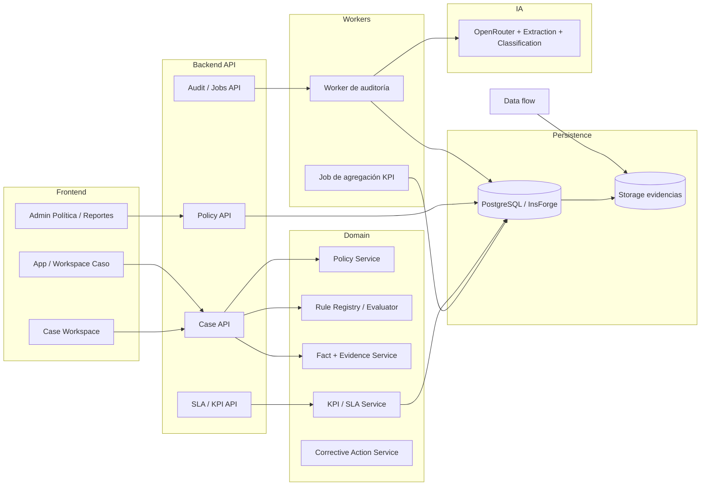

# PLAN DE IMPLEMENTACIÓN — MEJORA CONTINUA

## 1. Resumen ejecutivo

El objetivo no es reemplazar el auditor actual ni poner en riesgo la base funcional ya construida. El objetivo es evolucionar el sistema existente de auditoría de cancelaciones hacia una plataforma de auditoría con trazabilidad, versionado y gobierno de política/reglas, manteniendo la arquitectura actual y reutilizando sus motores principales.

Se construirá un modelo donde:

- cada caso conserva su contexto completo;
- cada dictamen se liga a política, numerales, reglas, evidencia y actor;
- una regla o política nueva no altera retrospectivamente un dictamen histórico;
- la IA cumple un rol de apoyo para extracción, clasificación, explicación y detección de inconsistencias, pero nunca decide solo ni reemplaza la lógica determinística.

Lo que NO se va a reconstruir:

- no se reescribe el motor determinístico existente;
- no se reemplaza el pipeline actual de extracción por una segunda arquitectura paralela;
- no se elimina la cola asíncrona de jobs ni el modelo LLM existente;
- no se reemplaza InsForge/PostgreSQL ni la generación de PDF canónica;
- no se convierte el proyecto en un sistema genérico de tickets.

El foco arquitectónico es de gobierno y trazabilidad: política + reglas + evidencias + decisiones con versión explícita.

---

## 2. Arquitectura actual validada

### 2.1 Estado real verificado

La base funcional ya existe y coincide con la auditoría previa, con diferencias relevantes que deben consignarse:

- Frontend SPA Vite + React 19 en `src/App.tsx` con un monolito funcional y varios componentes de auditoría no conectados directamente a una arquitectura de vistas actualizada.
- API Express en `src/server/app.ts` con endpoints legacy y endpoints de flujo nuevo.
- Cola asíncrona en `src/lib/jobs` y `src/server/jobs-router.ts` con claim/heartbeat/requeue.
- Base de datos mediante esquema SQL en `migrations/` y acceso vía cliente InsForge en `src/lib/insforge/*`.
- Motor determinístico en `src/lib/decision-engine/` con reglas policy-locked y tests golden.
- Auditoría multimodal en `src/lib/audit/` y `src/lib/extraction/` con política embebida, hash, Zod y evidencia.
- Generación de PDF canónica en `src/lib/pdf/`.

### 2.2 Diferencias relevantes frente a la auditoría

1. El hardcode de `HEAVY_API_BASE` existe y no está desacoplado de entorno (`src/lib/api/config.ts`).
2. El proyecto ya tiene un arranque de jobs y un modelo de progreso, pero no una capa de versionado de política/reglas.
3. La capa de persistencia ya contiene `decision_runs` y `rule_evaluations` dentro del esquema inicial, pero no registra la política y el ruleset usados para la evaluación.
4. La identidad real aún no está implementada completamente; el esquema actual no es un sistema RBAC definitivo y el backend no tiene un usuario real con roles de gobierno.
5. El modelo de “Mejora Continua” aún no existe como entidad persistente; solo hay evidencia aislada de reglas y métricas.

### 2.3 Lo que sí está bien construido

- `RuleRegistry` + `RuleEngine` son una base útil y válida.
- Los tests golden ya existen para reglas determinísticas.
- El pipeline IA y de extracción está estructurado sin duplicar el motor determinístico.
- El patrón de jobs asíncronos es apropiado para tareas pesadas y para futuros agregados de KPI.

---

## 3. Arquitectura objetivo

### 3.1 Visión general

### 3.2 Frontend

Se mantiene la SPA en Vercel, pero la navegación del caso se reorganiza para limitar ruido y permitir trazabilidad:

- Resumen.
- Estudiante.
- Hechos.
- Timeline.
- Llamadas / audio / transcripción.
- Evidencias.
- Reglas evaluadas.
- Política y numerales.
- Inconsistencias.
- Datos faltantes.
- SLA y plazo.
- Dictamen.
- Actividad.

Cada conclusión tendrá un enlace directo a la evidencia y a la regla que la soporta.

### 3.3 Backend

Se recomienda mantener una API ligera para casos y configuración, con un runtime persistente para jobs pesados y procesamiento asíncrono. El backend no deben conocer la infraestructura del navegador. Los datos sensibles se mantienen en entorno del servidor y nunca en el frontend.

- API de caso: lecturas, dictamen, evaluación, jobs.
- API de política y reglas: CRUD de draft/approval, versionado, numerales, ruleset.
- API de métricas: KPIs, SLAs, ventanas, business calendar.
- Worker: extracción, clasificación, agregación y cálculos pesados.

### 3.4 Worker

El worker continúa siendo responsable de:

- extracción de evidencias;
- transcripciones; 
- clasificación; 
- evaluación determinística;
- agregación de KPI; 
- reencolado por staleness; 
- persistencia del progreso.

### 3.5 Base de datos y storage

Persistencia central en PostgreSQL/InsForge con:

- tablas de dominio del caso;
- tablas de política y reglas;
- tablas de KPI y SLA;
- tablas de trazabilidad y policy audit log;
- almacenamiento de evidencias y archivos asociados.

### 3.6 IA

La IA no decide solo. Su rol será:

- extracción ambiental;
- clasificación de hechos;
- asociar evidencia a hechos;
- detectar inconsistencias;
- sugerir explicación; 
- alimentar el motor determinístico.

El dictamen final se produce con reglas determinísticas y el snapshot de policy/ruleset activo.

---

## 4. Modelo de dominio objetivo

### 4.1 Entidades clave

1. Policy: identificador de la norma.
2. PolicyVersion: versión efectiva con vigencia y hash.
3. PolicyNumeral: numerales normativos, orden, texto, metadata.
4. Rule: regla evaluable con prioridad y vínculo a numeral.
5. RuleCondition: condiciones y parámetros de evaluación.
6. EvidenceRequirement: evidencia requerida por regla.
7. Case: expediente del caso de cancelación.
8. CaseFact: hecho relevante con valor, tipo, confianza, origen.
9. FactEvidenceLink: vínculo de hecho a evidencia.
10. DecisionRun: ejecución concreta de una decisión.
11. RuleEvaluation: resultado de evaluación de una regla dentro de un run.
12. SLA: plazo configurable por etapa.
13. BusinessCalendar: fechas laborables/no laborables.
14. KPI: indicador de mejora continua.
15. CorrectiveAction: plan de corrección y seguimiento.
16. PolicyAuditLog: historial de cambios y aprobaciones.

### 4.2 Responsabilidades

- Policy y PolicyVersion: gobiernan la normativa aplicada en un caso.
- Rule + RuleCondition + EvidenceRequirement: materializan la lógica de decisión como datos y configuración.
- CaseFact + FactEvidenceLink: conectan evidencia y hechos.
- DecisionRun + RuleEvaluation: hacen un dictamen reproducible.
- SLA + BusinessCalendar: calculan cumplimiento.
- KPI + CorrectiveAction: habilitan mejora continua.

---

## 5. Modelo de datos

A continuación el diseño base por tabla. Debe quedar como base para migraciones futuras; no se implementa todavía.

### 5.1 `policy`

- Propósito: catálogo de políticas normativas.
- Columnas: `id` UUID PK, `code` text unique, `name`, `description`, `status`, `created_by`, `created_at`, `updated_at`.
- FK: ninguna esencial.
- Índices: `code`, `status`.
- Constraints: `code` not null unique, `status` check ('draft','review','approved','active','retired').
- RLS: administrador de política debe consultar/editar drafts y aprobados; usuarios ejecutivos solo lectura de activas.
- Versionado: por `policy_version` y no por modificar la política en sitio.

### 5.2 `policy_version`

- Propósito: versión concreta de una política con vigencia y hash.
- Columnas: `id` UUID PK, `policy_id` UUID FK, `version` text, `effective_from`, `effective_to`, `status`, `hash`, `source_text`, `created_by`, `approved_by`, `created_at`, `approved_at`, `metadata` jsonb.
- FK: `policy_id -> policy.id`.
- Índices: `policy_id`, `version`, `effective_from/effective_to`, `status`.
- Constraints: unique `(policy_id, version)`, `hash` not null, `effective_to` >= `effective_from`.
- RLS: lectura restringida; escritura solo por admin de política.
- Versionado: núcleo del historial de interpretaciones.

### 5.3 `policy_numeral`

- Propósito: numerales normativos asociados a una versión, con orden y metadata.
- Columnas: `id` UUID PK, `policy_version_id` UUID FK, `code` text, `title`, `text`, `order_index`, `process_area`, `effective_from`, `effective_to`, `metadata` jsonb, `created_at`.
- FK: `policy_version_id -> policy_version.id`.
- Índices: `policy_version_id`, `order_index`, `process_area`, `code`.
- Constraints: not null text/code and unique `(policy_version_id, code)`.
- RLS: lectura para roles operativos; edits por admin de política.
- Versionado: cada numeral es versionado con su política.

### 5.4 `rules`

- Propósito: catálogo de reglas evaluables.
- Columnas: `id` UUID PK, `policy_version_id` UUID FK, `numeral_id` UUID FK nullable, `code` text, `name`, `description`, `priority`, `category`, `status`, `implementation_key` text, `version`, `created_by`, `created_at`, `updated_at`, `metadata` jsonb.
- FK: `policy_version_id` + `numeral_id`.
- Índices: `policy_version_id`, `numeral_id`, `code`, `priority`.
- Constraints: unique `(policy_version_id, code)`, priority positive.
- RLS: lectura pública dentro de roles autorizados; cambios con workflow.
- Versionado: cada regla tiene su versión y su código estable.

### 5.5 `rule_conditions`

- Propósito: lógica paramétrica de regla.
- Columnas: `id` UUID PK, `rule_id` UUID FK, `condition_type`, `field_path`, `operator`, `value`, `threshold`, `required_evidence`, `weight`, `order_index`, `metadata` jsonb.
- FK: `rule_id -> rules.id`.
- Índices: `rule_id`, `field_path`, `condition_type`.
- Constraints: `rule_id` not null; valid operators only by domain constraints.
- RLS: restricted to policy admins.
- Versionado: condiciona la regla con su versión.

### 5.6 `evidence_requirements`

- Propósito: evidencia mínima necesaria para soportar una regla o un numeral.
- Columnas: `id` UUID PK, `rule_id` UUID FK, `numeral_id` UUID FK, `requirement_code` text, `description`, `evidence_type`, `minimum_count`, `required`, `metadata` jsonb.
- FK: rule + numeral.
- Índices: `rule_id`, `numeral_id`, `evidence_type`.
- Constraints: config checks and `minimum_count >= 0`.
- RLS: policy-admin write, read by operation roles.
- Versionado: parte del rule set.

### 5.7 `decision_run`

- Propósito: ejecución concreta de la decisión con snapshot inviolable.
- Columnas: `id` UUID PK, `case_id` UUID FK, `policy_version_id` UUID FK, `ruleset_version` text, `ruleset_hash` text, `actor_id` UUID FK nullable, `run_at`, `inputs` jsonb, `outputs` jsonb, `summary`, `status`, `created_at`.
- FK: `case_id` + `policy_version_id` + `actor_id` if identity exists.
- Índices: `case_id`, `policy_version_id`, `actor_id`, `run_at`.
- Constraints: `ruleset_hash` not null if rules set is recorded; output not null.
- RLS: owner and reviewer access.
- Versionado: no se altera historicidad.

### 5.8 `rule_evaluation`

- Propósito: resultado individual por regla dentro de un run.
- Columnas: `id` UUID PK, `decision_run_id` UUID FK, `rule_id` UUID FK, `result`, `determinant`, `priority`, `reasoning` text, `missing_evidence` jsonb, `evidence_refs` jsonb, `created_at`.
- FK: `decision_run_id` + `rule_id`.
- Índices: `decision_run_id`, `rule_id`, `result`, `determinant`.
- Constraints: `result` check allowed states.
- RLS: read only to authorized roles; insert by system only.
- Versionado: deja trazabilidad de cada resultado.

### 5.9 `case`

- Propósito: expediente del caso de cancelación.
- Columnas: `id`, `ticket_id`, `student_id`, `status`, `current_result`, `assigned_to`, `created_at`, `updated_at`, `closed_at`, `case_snapshot` jsonb, `owner_id` uuid.
- FK: `assigned_to` + `owner_id` -> users.
- Índices: by status, assignment, created_at.
- Constraints: status enum.
- RLS: by assigned user / reviewer / admin.
- Versionado: snapshot and history in related tables.

### 5.10 `case_fact`

- Propósito: hecho relevante asociado al caso.
- Columnas: `id`, `case_id` FK, `fact_type`, `fact_value`, `confidence`, `source_system`, `source_id`, `page`, `timestamp`, `quotation`, `extraction_version`, `created_at`.
- FK: `case_id`.
- Índices: `case_id`, `fact_type`, `confidence`.
- Constraints: `fact_type` and value not null.
- RLS: as case access.
- Versionado: extraction version and source tracked.

### 5.11 `fact_evidence_link`

- Propósito: relación hecho → evidencia.
- Columnas: `id`, `case_fact_id`, `evidence_id`, `strength`, `reason`, `created_at`.
- FK: `case_fact_id` + `evidence_id`.
- Índices: `case_fact_id`, `evidence_id`.
- Constraints: not null.
- RLS: to case access roles.
- Versionado: keeps causal links in domain.

### 5.12 `evidence`

- Propósito: evidencia documental y multimedia, sin depender de storage externo directo.
- Columnas: `id`, `case_id`, `source_system`, `type`, `storage_key`, `storage_url`, `mime_type`, `sha256`, `size_bytes`, `page`, `timestamp`, `created_by`, `created_at`.
- FK: `case_id`.
- Índices: `case_id`, `type`, `source_system`.
- Constraints: required type and key.
- RLS: case owner/reviewer.
- Versionado: hash and storage key as immutable.

### 5.13 `kpis`

- Propósito: catálogo de indicadores por función y período.
- Columnas: `id`, `code`, `name`, `function_area`, `population`, `numerator_sql`, `denominator_sql`, `owner_role`, `target_value`, `threshold`, `period_type`, `status`, `created_at`, `updated_at`.
- FK: none or owner role mapping.
- Índices: `function_area`, `status`, `code`, `period_type`.
- Constraints: `target_value` numeric check if used.
- RLS: read by reporting roles; changes by policy/admin roles.
- Versionado: each KPI has a version and status.

### 5.14 `slas`

- Propósito: plazos del proceso.
- Columnas: `id`, `code`, `name`, `stage`, `duration_minutes`, `calendar_type`, `policy_version_id`, `owner_role`, `status`, `effective_from`, `effective_to`, `threshold_warning`, `threshold_critical`.
- FK: `policy_version_id`.
- Índices: `stage`, `status`, `calendar_type`, `policy_version_id`.
- Constraints: positive duration.
- RLS: read by workflow roles.
- Versionado: active version and effective dates.

### 5.15 `business_calendar`

- Propósito: fechas laborables/no laborables y ámbitos institucionales.
- Columnas: `id`, `date`, `is_business_day`, `calendar_type`, `description`, `scope`, `source`.
- Índices: `date`, `calendar_type`.
- Constraints: `date` unique per calendar_type and scope.
- RLS: read by process roles; write by admin.
- Versionado: not necessarily by policy version, but by validated calendar snapshot.

### 5.16 `corrective_action`

- Propósito: acciones correctivas sobre hallazgos y KPIs.
- Columnas: `id`, `kpi_id`, `case_id`, `title`, `description`, `root_cause`, `owner_id`, `status`, `due_at`, `completed_at`, `evidence_url`, `result`.
- FK: `kpi_id`, `case_id`, `owner_id`.
- Índices: `status`, `owner_id`, `due_at`.
- Constraints: due_at not null if status not draft.
- RLS: assigned and reviewer roles.
- Versionado: no modification of historical fact, only action lifecycle.

### 5.17 `policy_audit_log`

- Propósito: trazabilidad de cambios en política y reglas.
- Columnas: `id`, `policy_version_id`, `rule_id`, `actor_id`, `action`, `before_snapshot` jsonb, `after_snapshot` jsonb, `reason`, `created_at`.
- FK: `policy_version_id`, `rule_id`, `actor_id`.
- Índices: `policy_version_id`, `actor_id`, `created_at`.
- Constraints: action enum.
- RLS: admin roles and audit roles.
- Versionado: mandatory for governance.

### 5.18 `effective_contact_evaluation` (opcional, si se necesita modelado operacional)

- Propósito: no reemplaza la regla TypeScript, pero concentrar el dato de contacto.
- Columnas: `id`, `case_id`, `attempts`, `contact_channel`, `titular_identified`, `purpose_explained`, `decision_manifested`, `is_effective`, `criteria_json`, `evidence_refs`.
- FK: `case_id`.
- Constraints: status values.
- RLS: as case access.
- Versionado: by policy version if required.

---

## 6. Estrategia de migración

### 6.1 Principios

1. No se rompe producción ni se reemplaza el comportamiento actual de forma abrupta.
2. El código existente se reutiliza; las nuevas tablas se utilizan para gobierno y trazabilidad.
3. El motor TypeScript se mantiene como implementación canónica de reglas ya validadas, pero se registra y versiona a través de DB.
4. Todos los jobs agrícolas y de auditoría leen una versión immutable del ruleset.
5. El fallback seguro siempre existe: si no existe registro de regla configurada, se usa la regla embebida actual.

### 6.2 Secuencia recomendada

- Fase 0: estabilización y configuración.
- Fase 1: identidad y gobierno básico con `policy_version`/`policy_numeral`/`policy_audit_log`.
- Fase 2: reglas como datos y ruleset hash.
- Fase 3: hechos y trazabilidad por evidencia.
- Fase 4: calendario, SLA y KPI.
- Fase 5: dashboard y acciones correctivas.
- Fase 6: deprecación del legacy y reducción de huérfanos.

### 6.3 Compatibilidad con la infraestructura actual

- Cada `decision_run` debe persistir `policy_version_id` y `ruleset_hash`.
- Los jobs activos se ejecutan contra la versión asignada al momento de inicio.
- Una nueva política no reemplaza resultados históricos.
- La IA se alimenta con `numeral_ids` y `policy_version_id`, no solo con texto completo.

---

## 7. Fases

### F0 — Estabilización

Objetivo: dejar la base reproducible y asegurar que no cambie negocio.

- Alcance: `.env.example`, `HEAVY_API_BASE`, CI, `tsc --noEmit`, tests golden y jobs.
- Archivos: `src/lib/api/config.ts`, `package.json`, `.env.example`, `tests/`.
- Migraciones: ninguna funcional del dominio; sí limpieza de configuración.
- Endpoints: no cambio funcional.
- UI: no cambios funcionales.
- Tests: tipo de smoke + jobs.
- Dependencias: ninguna.
- Riesgos: entorno/claves y drift de configuración.
- Criterio de aceptación: configuraciones documentadas y reproducibles en entorno local/stage.

### F1 — Identidad/Gobierno

Objetivo: crear auth real y permitirse cambiar políticas con trazabilidad.

- Alcance: auth real, roles RBAC, `policy`, `policy_version`, `policy_numeral`, `policy_audit_log`.
- Archivos: `src/lib/insforge/*`, `src/server/*`, `migrations/*`.
- Migraciones: nuevas tablas.
- Endpoints: CRUD política y versiones.
- UI: `PoliciesView` como panel de gobierno.
- Tests: acceso y RBAC.
- Riesgos: conflicto con sistema actual sin auth.
- Criterio de aceptación: toda política nueva requiere versión, actor, aprobación y log.

### F2 — Policy/Rulesets

Objetivo: convertir reglas en configuración versionada sin romper el engine actual.

- Alcance: `rules`, `rule_conditions`, `evidence_requirements`, `ruleset_versions`, `ruleset_members`, `decision_run` con `policy_version_id` y `ruleset_hash`.
- Archivos: `src/lib/decision-engine/*` y adaptadores de carga desde DB.
- Tests: golden + compatibilidad.
- Riesgos: desalineación TS/DB.
- Criterio: reglas activas se ejecutan con la versión publicada sin jamás alterar decisiones históricas.

### F3 — Evidencia/Trazabilidad

Objetivo: materializar el vínculo hecho → evidencia → regla → numeral.

- Alcance: `case_fact`, `fact_evidence_link`, `evidence` y relación con la evaluación.
- UI: caso con navegación a evidencia.
- Tests: integración de fact/evidence.
- Riesgo: ambigüedad entre evidencia y datos del caso.
- Criterio: cada conclusión muestra fuente y evidencia asociada.

### F4 — Calendario/SLA

Objetivo: introducir fechas hábiles y plazos configurables.

- Alcance: `business_calendar`, `slas`, `case_sla_events` (si se requiriera), cálculo de elapsed/remaining.
- Archivos: dominio de fechas y lógica de cálculo.
- Tests: business-days y SLA breach.
- Criterio: cada caso puede calcular su deadline y estado de cumplimiento.

### F5 — KPI

Objetivo: introducir indicadores agregados.

- Alcance: `kpis`, agregación, reportes, dashboard de proceso.
- UI: `ReportsView` + panel de mejora.
- Tests: agregación periódica.
- Criterio: cada KPI se calcula desde el mismo modelo de hechos y decisiones.

### F6 — Acciones correctivas

Objetivo: cerrar el ciclo de mejora continua.

- Alcance: `corrective_action` y re-medición.
- UI: acciones y tracking.
- Riesgo: mezclar caso y proceso.
- Criterio: los hallazgos del proceso se gestionan sin mezclar con el dictamen individual.

### F7 — Cockpit

Objetivo: separar la operación del caso individual y la del proceso agregado.

- Alcance: workspace del caso, cockpit de proceso y navegación.
- Prerrequisito: F6 completado.
- Criterio: la UI del proceso no se mezcla con la del caso.

### F8 — Integraciones/Saneamiento

Objetivo: cerrar lagunas de integración y saneamiento de deuda técnica.

- Alcance: adapters externos, manejo de huérfanos y legacy flags.
- Prerrequisito: F7 completado.
- Criterio: no se rompen contratos ni producción.

### F9 — Legacy

Objetivo: eliminar rutas y servicios que ya no se utilizan.

- Alcance: endpoints legacy y archivos huérfanos.
- Prerrequisito: paridad funcional comprobada.
- Criterio: no se elimina nada sin rollback plan.

---

## 8. Feature flags

Se recomienda usar feature flags en los puntos de cambio más sensibles:

- `policy.rules_from_db` — usa reglas persistidas en DB antes que fallback TypeScript.
- `policy.ia_mode` — permite usar IA solo para extracción, clasificación y explicación; no para dictamen final.
- `policy.versioned_overrides` — habilita versiones con snapshots de policy.
- `kpi.aggregation_enabled` — activa agregaciones de reporte y KPIs.
- `calendar.business_days_enabled` — habilita calendario institucional.
- `ui.case_traceability_enabled` — habilita navegación por regla/evidencia.
- `legacy.audit_endpoints_enabled` — mantiene el acceso a rutas legacy durante rollout.

Se deben guardar como configuración en entorno y no dispersos en componentes React.

---

## 9. Rollback

### Fase 0

- revert de configuración y env.
- revert de CI sin tocar funcionalidad.

### Fase 1

- no se dehabilita auth si la base ya quedó en uso; se mantiene una política de acceso restringido y rollback a roles anónimos solo en staging.
- los cambios de `policy_version` no son destructivos; se puede desactivar una versión activa y volver a la anterior.

### Fase 2

- mantener `fallbackRuleRegistry` en código y desactivar lectura desde DB por feature flag.
- `decision_run` queda con `ruleset_hash` aunque no haya config activa; no se borran tech snapshots.

### Fase 3

- no borrar evidencias ni snapshots. Se conserva el vínculo `fact_evidence_link` y se deja la evidencia operable.

### Fase 4 y 5

- cálculo de SLA y KPI puede ser desactivado sin bloquear el caso individual.

### Fase 7

- los endpoints legacy se mantienen en modo off, no inmediatamente eliminados.

---

## 10. Deuda eliminada

La propuesta elimina o reduce varios problemas actuales:

- hardcode de base API pesada;
- política y reglas no versionadas;
- dos interpretaciones de la norma (TS vs IA);
- ausencia de identidad y roles reales;
- no hay versionado de policy/reglas per se;
- falta de trazabilidad del dictamen hacia evidencia y regla;
- `App.tsx` permanece monolítico, pero la capa de dominio se vuelve más clara;
- la UI huérfana de políticas/reports/settings pasa a ser un conjunto asociado a capacidades definidas; 
- los jobs se convierten en una capa operativa más clara y reutilizable;
- el legacy se vuelve gradual y controlado, no un “estado permanente sin gobierno”.

---

## Conclusión

El proyecto no requiere una reconstrucción total. Requiere una evolución disciplinada de datos, identidad, versionado y trazabilidad. La base técnica ya es útil y sólida; faltan las capas de gobierno y reproducibilidad. La propuesta prioriza conservar los motores existentes y convertir el sistema en una plataforma capaz de sostener la auditoría individual y la mejora continua sin perder la historia del caso.
